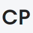
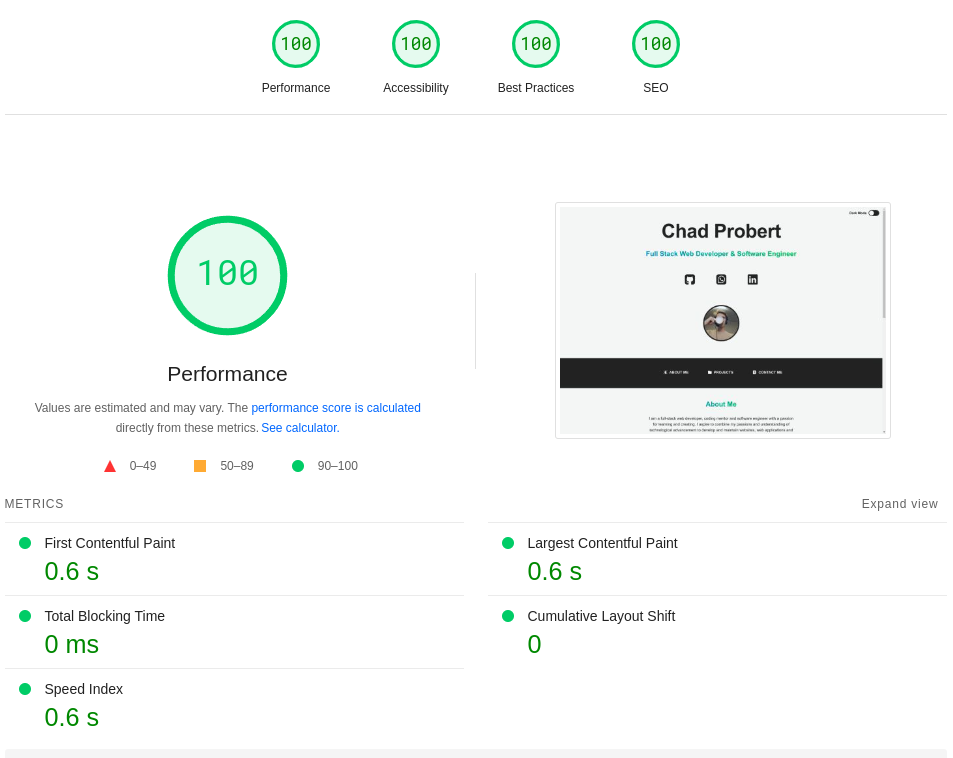

<a name="readme-top"></a>

<!-- PROJECT LOGO -->
<div align="center">
    

  ### My Developer Portfolio
  <p>
    <a href="https://chadprobert.github.io/">View Portfolio</a>
    ·
    <a href="https://github.com/ChadProbert/chadprobert.github.io/issues">Report Bug</a>
    ·
    <a href="https://github.com/ChadProbert/chadprobert.github.io/pulls">Request Feature</a>
  </p>

  <!-- SHIELDS.IO -->
  
  
  
  
  

  #### Built With

  
  
  

</div>

## SEO Score



## Getting Started

To get a local copy up and running follow these steps:

### Installation

1. ```sh
   git clone https://github.com/ChadProbert/chadprobert.github.io.git
   ```
3. Open the `index.html` file in your preferred browser.

## Setup and Configuration

Please note that these files have been minified and uglified to reduce the file size and improve performance.
To easily read the code and comments, you can download and use the [Prettier Extension](https://prettier.io/) to re-format the documents.
